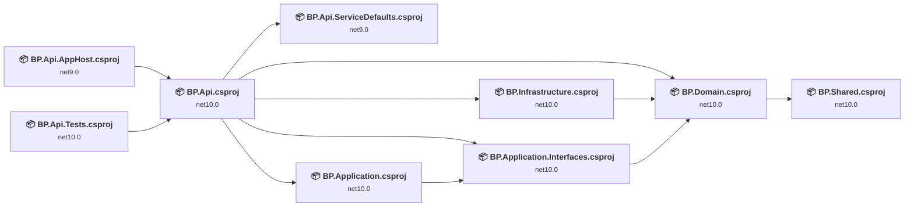
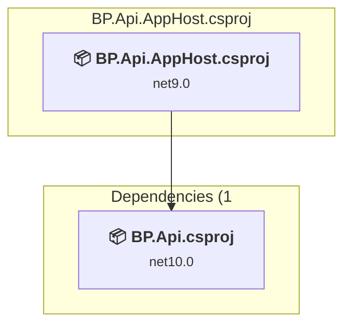
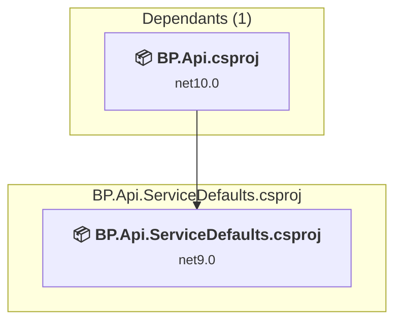
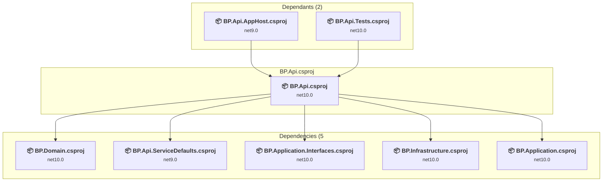
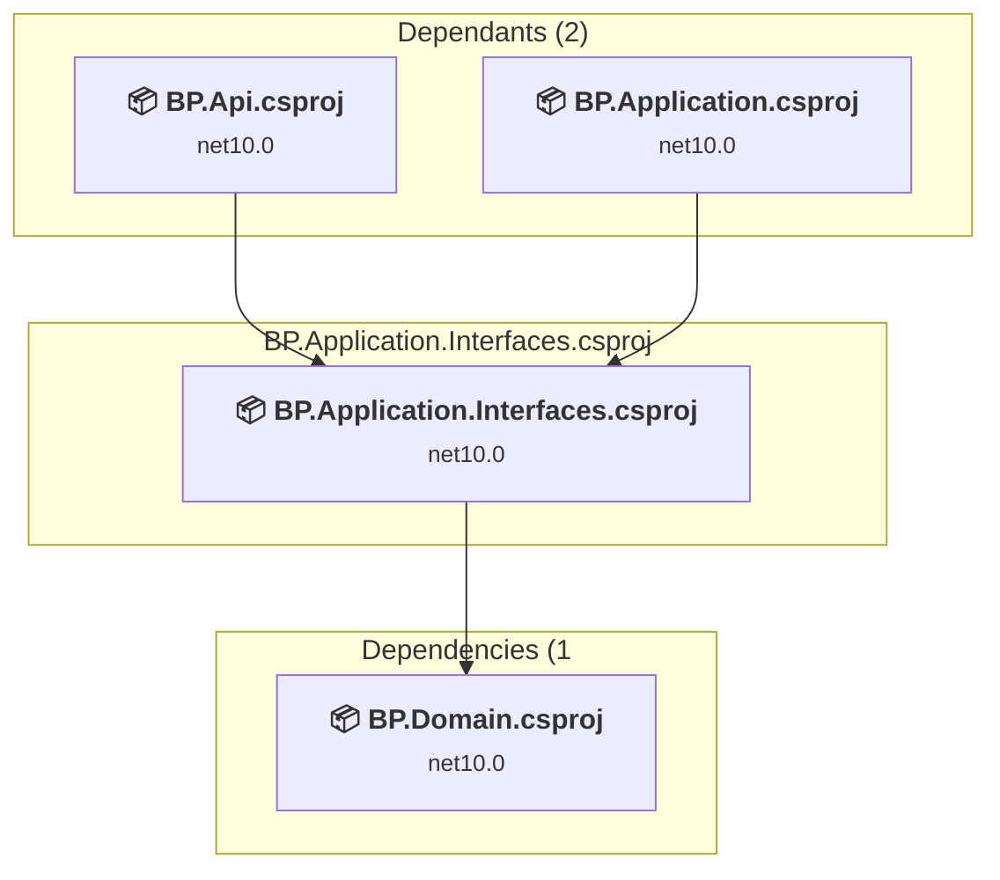
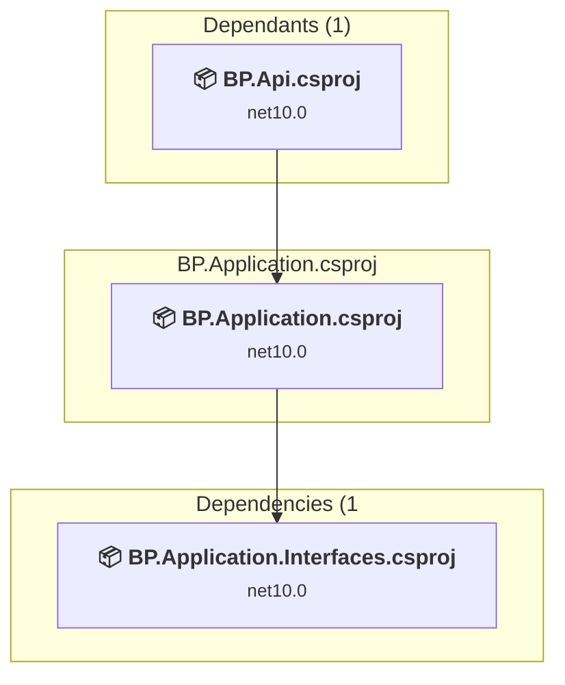
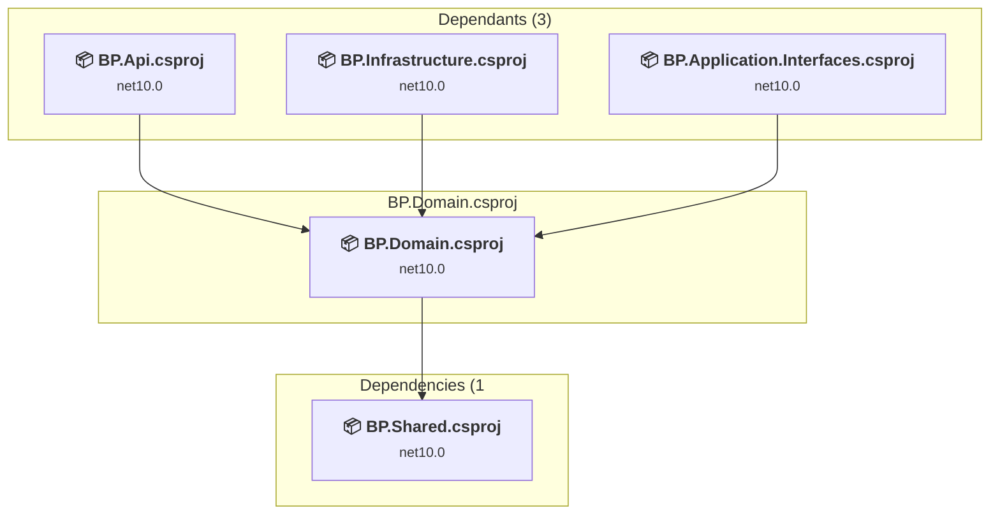
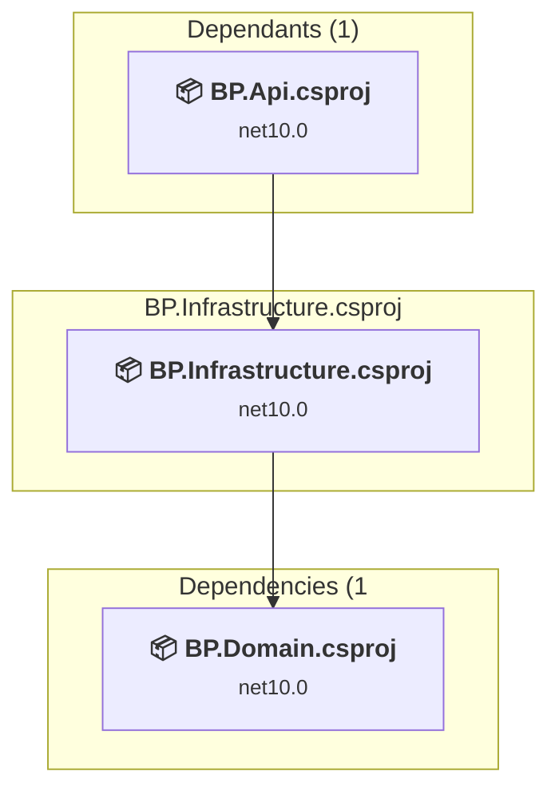
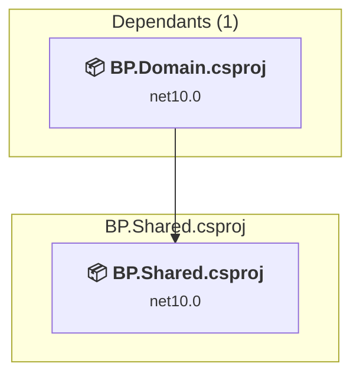
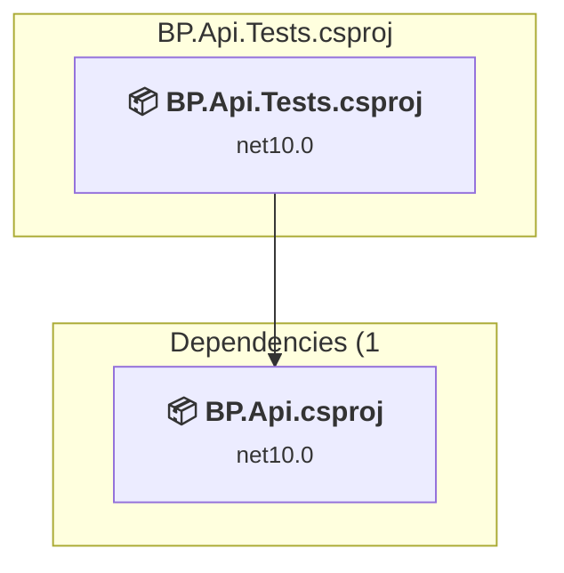

# Projects and dependencies analysis

This document provides a comprehensive overview of the projects and their dependencies in the context of upgrading to .NETCoreApp,Version=v8.0.

## Table of Contents

- [Executive Summary](#executive-Summary)
  - [Highlevel Metrics](#highlevel-metrics)
  - [Projects Compatibility](#projects-compatibility)
  - [Package Compatibility](#package-compatibility)
  - [API Compatibility](#api-compatibility)
- [Aggregate NuGet packages details](#aggregate-nuget-packages-details)
- [Top API Migration Challenges](#top-api-migration-challenges)
  - [Technologies and Features](#technologies-and-features)
  - [Most Frequent API Issues](#most-frequent-api-issues)
- [Projects Relationship Graph](#projects-relationship-graph)
- [Project Details](#project-details)

  - [BP.Api.AppHost\BP.Api.AppHost.csproj](#bpapiapphostbpapiapphostcsproj)
  - [BP.Api.ServiceDefaults\BP.Api.ServiceDefaults.csproj](#bpapiservicedefaultsbpapiservicedefaultscsproj)
  - [BP.Api\BP.Api.csproj](#bpapibpapicsproj)
  - [BP.Application.Interfaces\BP.Application.Interfaces.csproj](#bpapplicationinterfacesbpapplicationinterfacescsproj)
  - [BP.Application\BP.Application.csproj](#bpapplicationbpapplicationcsproj)
  - [BP.Domain\BP.Domain.csproj](#bpdomainbpdomaincsproj)
  - [BP.Infrastructure\BP.Infrastructure.csproj](#bpinfrastructurebpinfrastructurecsproj)
  - [BP.Shared\BP.Shared.csproj](#bpsharedbpsharedcsproj)
  - [tests\BP.Api.Tests\BP.Api.Tests.csproj](#testsbpapitestsbpapitestscsproj)

## Executive Summary

### Highlevel Metrics

| Metric | Count | Status |
| :--- | :---: | :--- |
| Total Projects | 9 | 0 require upgrade |
| Total NuGet Packages | 24 | All compatible |
| Total Code Files | 76 |  |
| Total Code Files with Incidents | 0 |  |
| Total Lines of Code | 3250 |  |
| Total Number of Issues | 0 |  |
| Estimated LOC to modify | 0+ | at least 0.0% of codebase |

### Projects Compatibility

| Project | Target Framework | Difficulty | Package Issues | API Issues | Est. LOC Impact | Description |
| :--- | :---: | :---: | :---: | :---: | :---: | :--- |
| [BP.Api.AppHost\BP.Api.AppHost.csproj](#bpapiapphostbpapiapphostcsproj) | net9.0 | ✅ None | 0 | 0 |  | DotNetCoreApp, Sdk Style = True |
| [BP.Api.ServiceDefaults\BP.Api.ServiceDefaults.csproj](#bpapiservicedefaultsbpapiservicedefaultscsproj) | net9.0 | ✅ None | 0 | 0 |  | ClassLibrary, Sdk Style = True |
| [BP.Api\BP.Api.csproj](#bpapibpapicsproj) | net10.0 | ✅ None | 0 | 0 |  | AspNetCore, Sdk Style = True |
| [BP.Application.Interfaces\BP.Application.Interfaces.csproj](#bpapplicationinterfacesbpapplicationinterfacescsproj) | net10.0 | ✅ None | 0 | 0 |  | ClassLibrary, Sdk Style = True |
| [BP.Application\BP.Application.csproj](#bpapplicationbpapplicationcsproj) | net10.0 | ✅ None | 0 | 0 |  | ClassLibrary, Sdk Style = True |
| [BP.Domain\BP.Domain.csproj](#bpdomainbpdomaincsproj) | net10.0 | ✅ None | 0 | 0 |  | ClassLibrary, Sdk Style = True |
| [BP.Infrastructure\BP.Infrastructure.csproj](#bpinfrastructurebpinfrastructurecsproj) | net10.0 | ✅ None | 0 | 0 |  | ClassLibrary, Sdk Style = True |
| [BP.Shared\BP.Shared.csproj](#bpsharedbpsharedcsproj) | net10.0 | ✅ None | 0 | 0 |  | ClassLibrary, Sdk Style = True |
| [tests\BP.Api.Tests\BP.Api.Tests.csproj](#testsbpapitestsbpapitestscsproj) | net10.0 | ✅ None | 0 | 0 |  | ClassLibrary, Sdk Style = True |

### Package Compatibility

| Status | Count | Percentage |
| :--- | :---: | :---: |
| ✅ Compatible | 24 | 100.0% |
| ⚠️ Incompatible | 0 | 0.0% |
| 🔄 Upgrade Recommended | 0 | 0.0% |
| ***Total NuGet Packages*** | ***24*** | ***100%*** |

### API Compatibility

| Category | Count | Impact |
| :--- | :---: | :--- |
| 🔴 Binary Incompatible | 0 | High - Require code changes |
| 🟡 Source Incompatible | 0 | Medium - Needs re-compilation and potential conflicting API error fixing |
| 🔵 Behavioral change | 0 | Low - Behavioral changes that may require testing at runtime |
| ✅ Compatible | 0 |  |
| ***Total APIs Analyzed*** | ***0*** |  |

## Aggregate NuGet packages details

| Package | Current Version | Suggested Version | Projects | Description |
| :--- | :---: | :---: | :--- | :--- |
| Aspire.Hosting.AppHost | 9.2.1 |  | [BP.Api.AppHost.csproj](#bpapiapphostbpapiapphostcsproj) | ✅Compatible |
| Aspire.Hosting.Azure.Storage | 9.4.1 |  | [BP.Api.AppHost.csproj](#bpapiapphostbpapiapphostcsproj) | ✅Compatible |
| Azure.Data.Tables | 12.11.0 |  | [BP.Domain.csproj](#bpdomainbpdomaincsproj) | ✅Compatible |
| Azure.Storage.Blobs | 12.24.1 |  | [BP.Infrastructure.csproj](#bpinfrastructurebpinfrastructurecsproj) | ✅Compatible |
| Microsoft.AspNetCore.Authentication.JwtBearer | 9.0.8 |  | [BP.Api.csproj](#bpapibpapicsproj) | ✅Compatible |
| Microsoft.AspNetCore.Cryptography.KeyDerivation | 9.0.8 |  | [BP.Application.csproj](#bpapplicationbpapplicationcsproj) | ✅Compatible |
| Microsoft.AspNetCore.Http | 2.2.2 |  | [BP.Api.Tests.csproj](#testsbpapitestsbpapitestscsproj) | ✅Compatible |
| Microsoft.AspNetCore.Mvc.Core | 2.2.5 |  | [BP.Api.Tests.csproj](#testsbpapitestsbpapitestscsproj) | ✅Compatible |
| Microsoft.AspNetCore.OpenApi | 9.0.8 |  | [BP.Api.csproj](#bpapibpapicsproj) | ✅Compatible |
| Microsoft.Extensions.DependencyInjection | 10.0.0-preview.7.25380.108 |  | [BP.Api.csproj](#bpapibpapicsproj) [BP.Application.csproj](#bpapplicationbpapplicationcsproj) [BP.Infrastructure.csproj](#bpinfrastructurebpinfrastructurecsproj) | ✅Compatible |
| Microsoft.Extensions.Http.Resilience | 9.4.0 |  | [BP.Api.ServiceDefaults.csproj](#bpapiservicedefaultsbpapiservicedefaultscsproj) | ✅Compatible |
| Microsoft.Extensions.Options | 9.0.4 |  | [BP.Application.csproj](#bpapplicationbpapplicationcsproj) | ✅Compatible |
| Microsoft.Extensions.ServiceDiscovery | 9.2.1 |  | [BP.Api.ServiceDefaults.csproj](#bpapiservicedefaultsbpapiservicedefaultscsproj) | ✅Compatible |
| Microsoft.IdentityModel.Tokens | 8.14.0 |  | [BP.Application.csproj](#bpapplicationbpapplicationcsproj) | ✅Compatible |
| Moq | 4.18.4 |  | [BP.Api.Tests.csproj](#testsbpapitestsbpapitestscsproj) | ✅Compatible |
| OpenTelemetry.Exporter.OpenTelemetryProtocol | 1.11.2 |  | [BP.Api.ServiceDefaults.csproj](#bpapiservicedefaultsbpapiservicedefaultscsproj) | ✅Compatible |
| OpenTelemetry.Extensions.Hosting | 1.11.2 |  | [BP.Api.ServiceDefaults.csproj](#bpapiservicedefaultsbpapiservicedefaultscsproj) | ✅Compatible |
| OpenTelemetry.Instrumentation.AspNetCore | 1.11.1 |  | [BP.Api.ServiceDefaults.csproj](#bpapiservicedefaultsbpapiservicedefaultscsproj) | ✅Compatible |
| OpenTelemetry.Instrumentation.Http | 1.11.1 |  | [BP.Api.ServiceDefaults.csproj](#bpapiservicedefaultsbpapiservicedefaultscsproj) | ✅Compatible |
| OpenTelemetry.Instrumentation.Runtime | 1.11.1 |  | [BP.Api.ServiceDefaults.csproj](#bpapiservicedefaultsbpapiservicedefaultscsproj) | ✅Compatible |
| Swashbuckle.AspNetCore | 9.0.4 |  | [BP.Api.csproj](#bpapibpapicsproj) | ✅Compatible |
| System.IdentityModel.Tokens.Jwt | 8.14.0 |  | [BP.Application.csproj](#bpapplicationbpapplicationcsproj) | ✅Compatible |
| xunit | 2.6.2 |  | [BP.Api.Tests.csproj](#testsbpapitestsbpapitestscsproj) | ✅Compatible |
| xunit.runner.visualstudio | 2.6.2 |  | [BP.Api.Tests.csproj](#testsbpapitestsbpapitestscsproj) | ✅Compatible |

## Top API Migration Challenges

### Technologies and Features

| Technology | Issues | Percentage | Migration Path |
| :--- | :---: | :---: | :--- |

### Most Frequent API Issues

| API | Count | Percentage | Category |
| :--- | :---: | :---: | :--- |

## Projects Relationship Graph

Legend:
📦 SDK-style project
⚙️ Classic project

## Project Details

### BP.Api.AppHost\BP.Api.AppHost.csproj

#### Project Info

- **Current Target Framework:** net9.0✅
- **SDK-style**: True
- **Project Kind:** DotNetCoreApp
- **Dependencies**: 1
- **Dependants**: 0
- **Number of Files**: 1
- **Lines of Code**: 21
- **Estimated LOC to modify**: 0+ (at least 0.0% of the project)

#### Dependency Graph

Legend:
📦 SDK-style project
⚙️ Classic project

### API Compatibility

| Category | Count | Impact |
| :--- | :---: | :--- |
| 🔴 Binary Incompatible | 0 | High - Require code changes |
| 🟡 Source Incompatible | 0 | Medium - Needs re-compilation and potential conflicting API error fixing |
| 🔵 Behavioral change | 0 | Low - Behavioral changes that may require testing at runtime |
| ✅ Compatible | 0 |  |
| ***Total APIs Analyzed*** | ***0*** |  |

### BP.Api.ServiceDefaults\BP.Api.ServiceDefaults.csproj

#### Project Info

- **Current Target Framework:** net9.0✅
- **SDK-style**: True
- **Project Kind:** ClassLibrary
- **Dependencies**: 0
- **Dependants**: 1
- **Number of Files**: 1
- **Lines of Code**: 126
- **Estimated LOC to modify**: 0+ (at least 0.0% of the project)

#### Dependency Graph

Legend:
📦 SDK-style project
⚙️ Classic project

### API Compatibility

| Category | Count | Impact |
| :--- | :---: | :--- |
| 🔴 Binary Incompatible | 0 | High - Require code changes |
| 🟡 Source Incompatible | 0 | Medium - Needs re-compilation and potential conflicting API error fixing |
| 🔵 Behavioral change | 0 | Low - Behavioral changes that may require testing at runtime |
| ✅ Compatible | 0 |  |
| ***Total APIs Analyzed*** | ***0*** |  |

### BP.Api\BP.Api.csproj

#### Project Info

- **Current Target Framework:** net10.0✅
- **SDK-style**: True
- **Project Kind:** AspNetCore
- **Dependencies**: 5
- **Dependants**: 2
- **Number of Files**: 27
- **Lines of Code**: 1788
- **Estimated LOC to modify**: 0+ (at least 0.0% of the project)

#### Dependency Graph

Legend:
📦 SDK-style project
⚙️ Classic project

### API Compatibility

| Category | Count | Impact |
| :--- | :---: | :--- |
| 🔴 Binary Incompatible | 0 | High - Require code changes |
| 🟡 Source Incompatible | 0 | Medium - Needs re-compilation and potential conflicting API error fixing |
| 🔵 Behavioral change | 0 | Low - Behavioral changes that may require testing at runtime |
| ✅ Compatible | 0 |  |
| ***Total APIs Analyzed*** | ***0*** |  |

### BP.Application.Interfaces\BP.Application.Interfaces.csproj

#### Project Info

- **Current Target Framework:** net10.0✅
- **SDK-style**: True
- **Project Kind:** ClassLibrary
- **Dependencies**: 1
- **Dependants**: 2
- **Number of Files**: 16
- **Lines of Code**: 220
- **Estimated LOC to modify**: 0+ (at least 0.0% of the project)

#### Dependency Graph

Legend:
📦 SDK-style project
⚙️ Classic project

### API Compatibility

| Category | Count | Impact |
| :--- | :---: | :--- |
| 🔴 Binary Incompatible | 0 | High - Require code changes |
| 🟡 Source Incompatible | 0 | Medium - Needs re-compilation and potential conflicting API error fixing |
| 🔵 Behavioral change | 0 | Low - Behavioral changes that may require testing at runtime |
| ✅ Compatible | 0 |  |
| ***Total APIs Analyzed*** | ***0*** |  |

### BP.Application\BP.Application.csproj

#### Project Info

- **Current Target Framework:** net10.0✅
- **SDK-style**: True
- **Project Kind:** ClassLibrary
- **Dependencies**: 1
- **Dependants**: 1
- **Number of Files**: 12
- **Lines of Code**: 519
- **Estimated LOC to modify**: 0+ (at least 0.0% of the project)

#### Dependency Graph

Legend:
📦 SDK-style project
⚙️ Classic project

### API Compatibility

| Category | Count | Impact |
| :--- | :---: | :--- |
| 🔴 Binary Incompatible | 0 | High - Require code changes |
| 🟡 Source Incompatible | 0 | Medium - Needs re-compilation and potential conflicting API error fixing |
| 🔵 Behavioral change | 0 | Low - Behavioral changes that may require testing at runtime |
| ✅ Compatible | 0 |  |
| ***Total APIs Analyzed*** | ***0*** |  |

### BP.Domain\BP.Domain.csproj

#### Project Info

- **Current Target Framework:** net10.0✅
- **SDK-style**: True
- **Project Kind:** ClassLibrary
- **Dependencies**: 1
- **Dependants**: 3
- **Number of Files**: 10
- **Lines of Code**: 150
- **Estimated LOC to modify**: 0+ (at least 0.0% of the project)

#### Dependency Graph

Legend:
📦 SDK-style project
⚙️ Classic project

### API Compatibility

| Category | Count | Impact |
| :--- | :---: | :--- |
| 🔴 Binary Incompatible | 0 | High - Require code changes |
| 🟡 Source Incompatible | 0 | Medium - Needs re-compilation and potential conflicting API error fixing |
| 🔵 Behavioral change | 0 | Low - Behavioral changes that may require testing at runtime |
| ✅ Compatible | 0 |  |
| ***Total APIs Analyzed*** | ***0*** |  |

### BP.Infrastructure\BP.Infrastructure.csproj

#### Project Info

- **Current Target Framework:** net10.0✅
- **SDK-style**: True
- **Project Kind:** ClassLibrary
- **Dependencies**: 1
- **Dependants**: 1
- **Number of Files**: 7
- **Lines of Code**: 294
- **Estimated LOC to modify**: 0+ (at least 0.0% of the project)

#### Dependency Graph

Legend:
📦 SDK-style project
⚙️ Classic project

### API Compatibility

| Category | Count | Impact |
| :--- | :---: | :--- |
| 🔴 Binary Incompatible | 0 | High - Require code changes |
| 🟡 Source Incompatible | 0 | Medium - Needs re-compilation and potential conflicting API error fixing |
| 🔵 Behavioral change | 0 | Low - Behavioral changes that may require testing at runtime |
| ✅ Compatible | 0 |  |
| ***Total APIs Analyzed*** | ***0*** |  |

### BP.Shared\BP.Shared.csproj

#### Project Info

- **Current Target Framework:** net10.0✅
- **SDK-style**: True
- **Project Kind:** ClassLibrary
- **Dependencies**: 0
- **Dependants**: 1
- **Number of Files**: 3
- **Lines of Code**: 24
- **Estimated LOC to modify**: 0+ (at least 0.0% of the project)

#### Dependency Graph

Legend:
📦 SDK-style project
⚙️ Classic project

### API Compatibility

| Category | Count | Impact |
| :--- | :---: | :--- |
| 🔴 Binary Incompatible | 0 | High - Require code changes |
| 🟡 Source Incompatible | 0 | Medium - Needs re-compilation and potential conflicting API error fixing |
| 🔵 Behavioral change | 0 | Low - Behavioral changes that may require testing at runtime |
| ✅ Compatible | 0 |  |
| ***Total APIs Analyzed*** | ***0*** |  |

### tests\BP.Api.Tests\BP.Api.Tests.csproj

#### Project Info

- **Current Target Framework:** net10.0✅
- **SDK-style**: True
- **Project Kind:** ClassLibrary
- **Dependencies**: 1
- **Dependants**: 0
- **Number of Files**: 2
- **Lines of Code**: 108
- **Estimated LOC to modify**: 0+ (at least 0.0% of the project)

#### Dependency Graph

Legend:
📦 SDK-style project
⚙️ Classic project

### API Compatibility

| Category | Count | Impact |
| :--- | :---: | :--- |
| 🔴 Binary Incompatible | 0 | High - Require code changes |
| 🟡 Source Incompatible | 0 | Medium - Needs re-compilation and potential conflicting API error fixing |
| 🔵 Behavioral change | 0 | Low - Behavioral changes that may require testing at runtime |
| ✅ Compatible | 0 |  |
| ***Total APIs Analyzed*** | ***0*** |  |

